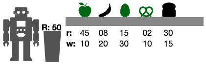

# Optimizando Jambo-tubos

El problema: dado un _Jabotubo_ con resistencia , y una secuencia ordenada de 
productos , cada uno con un peso asociado  y una resistencia asociada ,
determinar la máxima cantidad de productos que pueden apilarse en un tubo sin que ninguno
esté aplastado.

En la figura se ilustra un ejemplo con , ,
 y . La solución óptima es , y consiste
en tomar los elementos ,  y . Notar que la solución alternativa tomando los
elementos ,  y  no es factible porque la suma de sus pesos es .

> Nota: los productos solamente pueden ser apilados en el orden en que son recibidos de la
> cinta transportadora. Para este problema, asumiremos que todos los valores mencionados
> son enteros no negativos.

<div style="text-align: center;">
  
  <p><i>Ejemplo de instancia del problema de Jambo-tubos.</i></p>
</div>

## Proyecto

Implementamos 3 algoritmos en C++ para resolver este problema:

- Fuerza bruta
- Backtracking
- Programación dinámica

El proyecto está organizado de la sigueinte forma:

- `/src` contiene el código fuente
- En `/bin` guardaremos los binarios
- `/input` contiene entradas válidas

## Algoritmos

Para compilar el código fuente:

```
g++ src/main.cpp -o bin/algo3-tp1
```

Para ejecutar:

```
./bin/algo3-tp1 RUTA_A_ENTRADA ALGORITMO
```

Se puede ejecutar ambos comandos en una sola sentencia:

```
g++ src/main.cpp -o bin/algo3-tp1 && ./bin/algo3-tp1 RUTA_A_ENTRADA ALGORITMO
```

Ejemplo:

```
g++ src/main.cpp -o bin/algo3-tp1 && ./bin/algo3-tp1 ./input/sample2 3 0
```

## Experimentacion

Para usar Python v3.6.5

1. Instalar `pyenv` (una sola vez)

  _Como instalar `pyenv`_: https://github.com/pyenv/pyenv#installation

  Mac:

  ```
  brew update
  brew install pyenv
  eval "$(pyenv init -)"
  ```

2. Instalar v3.6.5 (una sola vez)

  ```
  pyenv install 3.6.5
  ```

3. Activar v3.6.5 (cada nueva consola debe ejecutarlo una vez)

  ```
  pyenv install 3.6.5
  ```

4. Instalar dependencias

  ```
  pip install -r requirements.txt
  ```

## Ayuda

Mas ayuda en:

```
./bin/algo3-tp1 help
```


